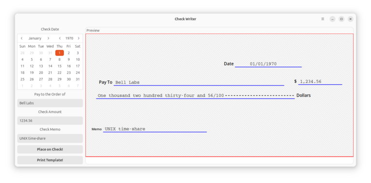

# CheckWriter

[](https://github.com/ashafq/CheckWriter/actions/workflows/c-cpp.yml)

CheckWriter is a modern GTK4-based desktop application designed to simplify the
process of writing checks. Featuring an intuitive graphical interface, it
allows you to input check details with ease, preview the layout in real time,
and generate error-free outputs.



*NOTE: This is still a work in progress.*

## Features

Say goodbye to manual errors and tedious handwriting. CheckWriter enables you
to:

- **Select Dates**: Use a built-in calendar to select dates, formatted
  automatically in the `MM/DD/YYYY` (`en_US`) standard.
- **Convert Amounts to Words**: Automatically convert numeric amounts to their
  corresponding text representation for check validation.
- **Real-Time Previews**: Preview your check layout dynamically before
  committing to printing.
- **Place Details on Standard US Checks**: Compatible with most personal US
  check templates.

## License

This project is licensed under the GNU General Public License v3.0 or later
(GPL-3.0+). For full terms and conditions, refer to the [COPYING](COPYING) file
included with this project.

## Dependencies

CheckWriter requires the following dependencies:

| Dependency   | Version  | Purpose                     |
|--------------|----------|-----------------------------|
| **GTK**      | ≥ 4.0    | GUI Framework               |
| **libadwaita** | ≥ 1.4   | GNOME-based GUI styling framework |
| **Meson**    | ≥ 0.62.0 | Build system configuration  |
| **Ninja**    | ≥ 1.11.1 | Fast build system           |

Ensure these dependencies are installed before building the application.

## Installation

To install CheckWriter, follow the standard Meson build process:

1. **Configure the build**:
   ```bash
   meson setup --wipe --prefix=~/.local _build .
   ```

2. **Compile and install**:
   ```bash
   ninja -C _build install
   ```

3. **Environment Setup**:
   If running the application from `~/.local/`, you may need to set environment
   variables depending on your Linux distribution. For example:

   ```bash
   export PATH=$HOME/.local/bin:$PATH
   export XDG_DATA_DIRS=$HOME/.local/share:$XDG_DATA_DIRS
   export LD_LIBRARY_PATH=$HOME/.local/lib:$LD_LIBRARY_PATH
   ```

Note: these steps may vary depending on distribution

## Getting Started

After installation, you can launch the application with:
```bash
checkwriter
```

Once open, you can:
1. Select a check date using the calendar widget.
2. Enter details such as the payee, amount, and memo.
3. Preview your changes in real time.
4. Print the completed check or export it for external printing.

## Contributing

Contributions to CheckWriter are welcome! Whether you want to report bugs,
suggest features, or submit code, please follow these steps:

1. Fork the repository.
2. Create a new branch:
   ```bash
   git checkout -b feature-name
   ```
3. Commit your changes:
   ```bash
   git commit -m "Add feature: feature-name"
   ```
4. Push the branch:
   ```bash
   git push origin feature-name
   ```
5. Open a pull request.

## Acknowledgments

CheckWriter leverages the following technologies:
- **GTK** for the user interface.
- **libadwaita** for styling and modern GNOME integration.
- **Meson and Ninja** for efficient building and installation processes.
